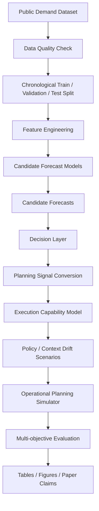

# System Flow

The repository models the path from public demand data to operational planning evidence.

The decision layer is the research focus. It converts candidate forecasts into planning signals while accounting for model switching, planning signal volatility, and execution capacity.
